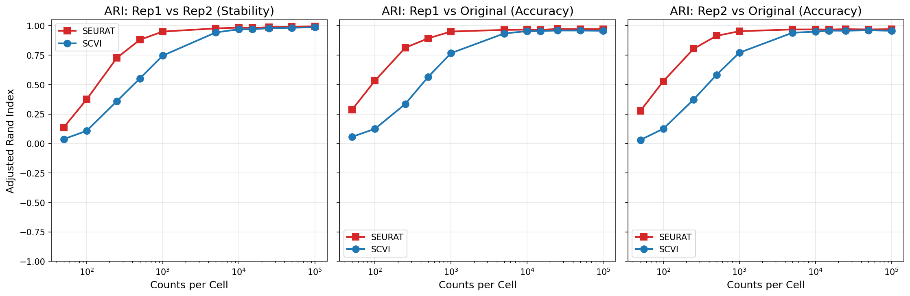

# Downsampling Experiment

At what sequencing depth do cell type assignments stabilize on Smart-seq v4 scRNA-seq data?

## Approach

1. Pull a Smart-seq reference from CellxGene Census.
2. Stratified split into reference (70%) and query (30%) by `cell_type`.
3. For each target depth, downsample the query twice with two random seeds (multinomial sampling per cell).
4. Run Seurat and scVI label transfer on each replicate.
5. Score Adjusted Rand Index (ARI) between the two replicates at each depth.

## Run

```bash
bash run_pipeline.sh           # Default human run, with -resume
nextflow run main.nf -resume   # Same thing, direct
```

Conda envs are hardcoded in `nextflow.config`: `scanpyenv` (Python: scanpy, scvi-tools, cellxgene-census) and `r4.3` (Seurat, SeuratDisk). Executor is SLURM with `-C thrd64 --cpus-per-task=8`.

## Parameters used

| Parameter | Value |
|---|---|
| Dataset | Multiple Cortical Areas SMART-seq (human) |
| Census version | 2024-07-01 |
| Cells subsampled | 5000 |
| Reference / query split | 70 / 30, stratified by `cell_type` |
| Depths (counts/cell) | 50, 1k, 5k, 10k, 15k, 25k, 50k, 100k |
| Seeds | 42, 123 |
| Seurat normalization | SCTransform, 50 PCs |
| scVI predictor | RandomForest on scVI latent embeddings |
| Stability threshold | ARI &ge; 0.95 |

## Results

Human Multiple Cortical Areas SMART-seq:



Minimum depth for ARI &ge; 0.95 (`stability_summary.tsv`):

| Method | Min depth (counts/cell) |
|---|---|
| Seurat | 5,000 |
| scVI | 10,000 |

Both methods saturate by 25k counts/cell. Seurat reaches the 0.95 stability threshold earlier than scVI on this dataset.

The query set has an original average depth of ~1.29M counts/cell with ~6,600 genes detected per cell (median); all target depths sit at least one order of magnitude below this.

Note: counts here are gene-assigned read counts in the expression matrix, not raw sequencer reads. Smart-seq v4 has no UMIs, so PCR duplicates may be present depending on upstream processing.

## Related work

[Ma et al. 2022, *Science*](https://doi.org/10.1126/science.abo7257) ran a similar analysis on human dlPFC, subsampling cells and UMIs to evaluate per-subtype separability with AUC, with results stratified by subtype abundance.

Their depth axis is in UMI counts; ours is in Smart-seq read counts. Smart-seq v4 has no UMIs, so matrix counts are reads with PCR duplicates retained; Jorstad et al.'s QC excludes cells with < 50% unique reads, which bounds but doesn't eliminate the bias. Ma et al. don't specify where in their pipeline the downsampling happens, so it's unclear whether their UMIs are deduplicated at the point of sampling. Depth thresholds reported here are therefore not directly comparable to theirs.


## Output layout

Published under `${organism}/${dataset_name}/${census_version}/`:

```
downsampled/depth_*/rep_*/   downsampled h5ads + per-run stats
seurat_processed/            Seurat .rds files
predictions/{seurat,scvi}/   per-cell predicted labels
comparisons/{seurat,scvi}/   pairwise replicate metrics
results/                     final plots and stability_summary.tsv
```

Raw `.h5ad`, `.rds`, and the scVI model directory are gitignored.

## Data

Human Multiple Cortical Areas SMART-seq from [Jorstad et al. 2023](https://doi.org/10.1126/science.adf6812), accessed via [CellxGene](https://cellxgene.cziscience.com/collections/d17249d2-0e6e-4500-abb8-e6c93fa1ac6f).

## References

Jorstad, N. L., et al. (2023). Transcriptomic cytoarchitecture reveals principles of human neocortex organization. *Science*, 382(6667), eadf6812. https://doi.org/10.1126/science.adf6812

Ma, S., et al. (2022). Molecular and cellular evolution of the primate dorsolateral prefrontal cortex. *Science*, 377(6614). https://doi.org/10.1126/science.abo7257
